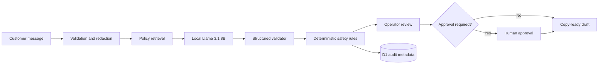

# SupportFlow

**A local-first, policy-grounded AI review workspace for e-commerce support teams.**

SupportFlow turns an unstructured customer message into a structured support review: category, urgency, relevant policy, missing information, recommended action, approval boundary, and an editable reply draft. It combines a local language model with deterministic safety rules so consequential actions remain under human control.

> Built as a five-day AI OS sprint. The project uses synthetic e-commerce data and a disclosed candidate-proxy workflow; it does not claim independent target-user research.

## Results

| Metric                 | Generic-prompt baseline |      SupportFlow |  Change |
| ---------------------- | ----------------------: | ---------------: | ------: |
| Full-rubric pass rate  |               8% (1/12) | **100% (12/12)** |  +92 pp |
| Category accuracy      |                     75% |         **100%** |  +25 pp |
| Urgency accuracy       |                     75% |         **100%** |  +25 pp |
| Approval accuracy      |                     75% |         **100%** |  +25 pp |
| Policy retrieval       |           Not available |         **100%** |   Added |
| Critical failures      |                       3 |            **0** |      −3 |
| Median processing time |                  1.60 s |           2.19 s | +0.60 s |

A separate paraphrase and multi-intent challenge suite improved from **2/12 to 12/12** after Day 4 hardening. Three unsafe or incomplete model drafts in the latest frozen run were corrected by guardrails before operator review.

See the [full comparison](Result/comparison.md), [raw final results](Result/final-results.json), and [failure analysis](Result/failure-analysis.md).

## What it does

- Classifies support tickets across returns, replacements, delivery, billing, cancellation, security, product information, complaints, and legal/safety risk.
- Retrieves the relevant versioned policy from a local knowledge base.
- Produces structured output with confidence, extracted facts, missing information, and a recommended next action.
- Redacts passwords and full card-number patterns before model inference.
- Applies deterministic urgency, approval, policy-content, and unsupported-action checks.
- Replaces unsafe or incomplete drafts with a safe fallback when needed.
- Records privacy-minimized review metadata in a D1 audit log.
- Keeps the reply editable and blocks copying approval-required drafts until a human approves them.

## System boundary

SupportFlow **reviews and drafts**. It does not:

- send an email;
- issue a refund or replacement;
- cancel or modify an order;
- access a live customer account;
- promise delivery or carrier action; or
- replace operator judgment.

Refunds, replacements, cancellations, security, legal, compatibility, and delivery-promise decisions remain human-controlled.

## How it works



The model proposes; deterministic rules enforce the operating boundary; a human makes the consequential decision.

## Quick start

### Prerequisites

- Node.js 22.13 or newer
- [Ollama](https://ollama.com/)
- The `llama3.1:8b` model

### Run

```powershell
git clone https://github.com/TMSifat/support-flow.git
cd support-flow
npm ci
ollama pull llama3.1:8b
powershell -ExecutionPolicy Bypass -File scripts/start-supportflow.ps1
```

Open [http://localhost:3000](http://localhost:3000), paste a ticket, and select **Review ticket**.

The startup script loads the supported `.env` settings, checks Ollama, verifies the configured model, creates the local D1 schema idempotently, and starts SupportFlow. No API key is required.

## Configuration

Defaults work for a standard local Ollama installation. Copy `.env.example` to `.env` only when the endpoint or model needs to change.

| Variable          | Default                  | Purpose               |
| ----------------- | ------------------------ | --------------------- |
| `OLLAMA_BASE_URL` | `http://127.0.0.1:11434` | Local Ollama endpoint |
| `OLLAMA_MODEL`    | `llama3.1:8b`            | Review model          |

Never commit a real `.env` file. Local environment files, build artifacts, database state, and generated output are excluded from Git.

## Evaluation

The same local model is used for the baseline and final system. The frozen suite covers representative, edge, validation, and high-risk cases.

```powershell
npm run day2:verify
npm run day3:verify
npm run day4:challenge
npm run baseline
npm run baseline:review
npm run evaluate
npm run evaluate:review
npm run lint
npx tsc --noEmit
npm run build
```

Canonical evidence lives in [`Result/`](Result/README.md):

- [Evaluation rubric](Result/evaluation-rubric.md)
- [Architecture and data flow](Result/architecture.md)
- [Baseline summary](Result/baseline-summary.md)
- [Final-system summary](Result/final-summary.md)
- [Day 4 hardening report](Result/day-4-evaluate-break-harden.md)
- [Portfolio case study](Result/case-study.md)
- [Operator runbook](Result/operator-runbook.md)
- [AI collaboration note](Result/ai-collaboration-note.md)
- [Five-minute demo script](Result/demo-script.md)
- [First two-week adoption plan](Result/adoption-plan.md)

## Project structure

```text
app/                 Review workspace and API routes
components/ui/       Reused interface primitives
data/                Policies and frozen evaluation cases
db/                  D1 schema and privacy-minimized audit functions
drizzle/             Reproducible database migration
lib/                 Contracts and support-review engine
scripts/             Startup, verification, evaluation, and review tools
Result/              Raw evidence and submission-ready documentation
```

## Reliability and privacy

- Empty or oversized input receives a clear validation error without calling the model.
- Invalid or unavailable model output is retried once; a second failure returns a clearly labelled category-specific fallback that always requires operator approval.
- Passwords and full card-number patterns are redacted before inference.
- Customer-message text is not stored in the audit database.
- Production dependencies currently report zero known vulnerabilities.

## Limitations

- The evaluation dataset contains 12 synthetic English-language cases.
- Candidate-proxy execution is documented, but independent target-user testing remains a follow-up.
- Keyword-based retrieval may need improvement for novel or multi-intent tickets.
- The system has no live order, inventory, payment, carrier, account, or email integration.
- Results may vary with a different model, prompt, or machine.
- Because inference runs through local Ollama, this repository is the primary reproducible delivery rather than a misleading public demo.

## Next iteration

The first two-week plan is to test with at least two independent operators, expand the frozen suite to 50 cases, measure unassisted completion and correction rates, add a read-only sandbox order lookup, and preserve a release gate of zero critical failures. See the [adoption and quality plan](Result/adoption-plan.md).

## AI collaboration disclosure

AI assisted with implementation, test generation, analysis, and documentation. The candidate owns the problem framing, scope, architecture, evaluation method, disclosed proxy execution, final review, and submission. Details are recorded in the [AI collaboration note](Result/ai-collaboration-note.md).
